### Introduction

The current project try to explain the past years and how Covid behave in our country. To show in the best way the data it's been choose the library PlotLy. Under here the text and the statics graphs are proposed, but if you want to interact with data you need to download the Notebook+ the Data sources and run them into your machine. Enjoy:)

# COVID-19 in Italy

It was the 21st of February 2020 when Italy discover that the far virus from China, **SarS covid 19**, it's out breaking its boundaries.
At Codogno, the first patient, the 'zero' one, is recovered in bad condition, with the necessity of oxygen.

> For who it take it? Which contact did he have? This a few of several questions that media and public order start to ask, to try to find reasons and trace this virus, which saw the light in Europe first in Italy.

In just a few hours, the bitter response: new cases, uncorrelated from the first one, are continuously found.

 The unlucky main protagonist of this starting of what we discover will be a global pandemic is north Italy, particularly Lombardy: the region will have quickly become famous for the province of Lodi, from which the first cases started, and Bergamo. From the scary first hours, a pandemic starts to seem harmless, like flu: the most important aspect of a pandemic starts to be not the health part but the economic one. Tourists start to delete the reservation, and politicians from all the parties start to run down all the viruses things.

> But data showed up another reality. 

Virus spreading decided in all Lombardy, not clearly in death, but in infection:

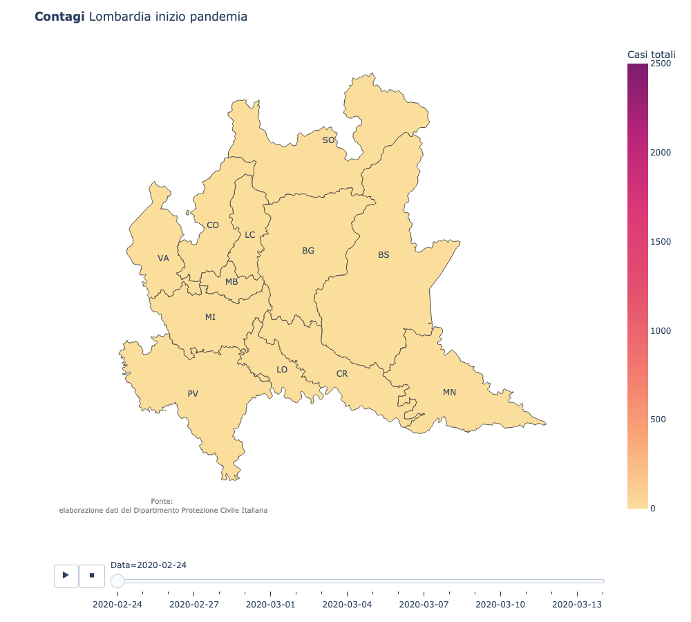

9th of March 2020 will be an important day, for all the western world: as did months before in China, also Italy adopt the use of a **lockdown** to control the one we became a pandemic.

 A total lockdown, an extreme solution became necessary for one important reason: pandemic run away from the authority control.
In the phase which will become the "first wave", COVID arrives in our country like a virus similar to its ancestors, the SARS or MERS coronavirus.
*High lethality virus, with bad transmissibility characteristics*. 

> This is not a COVID feature at all.

COVID-19 was silent in our country. Indeed updated data from the ISS shows that symptomatic patience can be seen from the beginning of February 

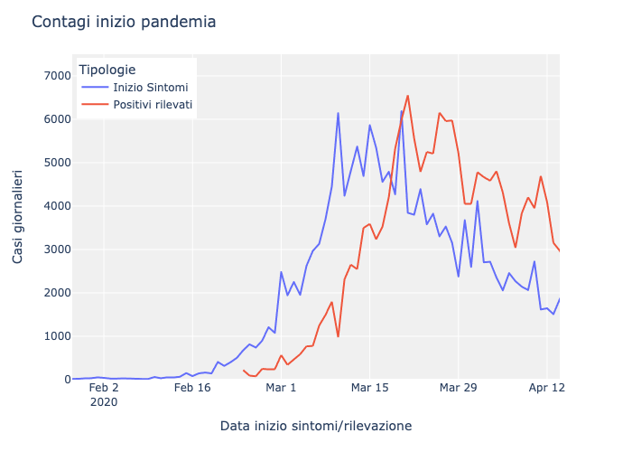

The initial effort of tracking the infection showed us the **impossibility** of it in the current condition. 
An important measure of it can be represented by the ratio of positive tests done in Italy. 
This, with advanced phases of the pandemic, became an important indicator of the control of the disease and restraining it. 
OMS indication asserts that a good level of contro**l can be shown by a ratio above the five percent**, for at least 2 weeks. As we can see, t**he ratio touches the 50% on lockdown days.**

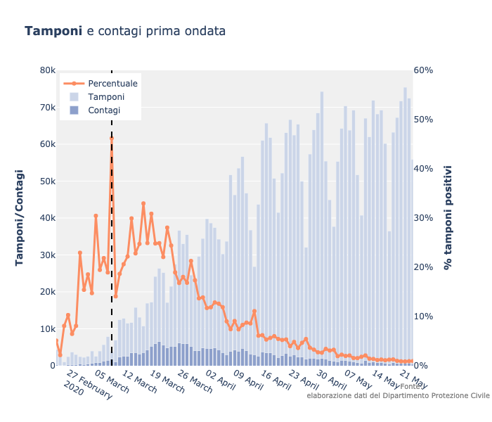

The data clearly shows the delay with which our country faces COVID 19.
Every day outbreaks appear and hospitals start quickly to saturate: this will characterize all the waves. 
The government tries to resolve the situation with a general and strict lockdown, to stop the circulation of the virus. 

But, as may be reasonable to understand that taking all the possible contacts almost at zero implies the impossibility of the virus to replicate, data doesn't show clearly the power of this maneuver. 
**Intensive therapy is an essential service to fight the mortality of the virus**. Italy suffers budget cut happened in these last years in health services, with lower number investiment in healthcare . After the saturation of TI, will be impossible to heal patients. 

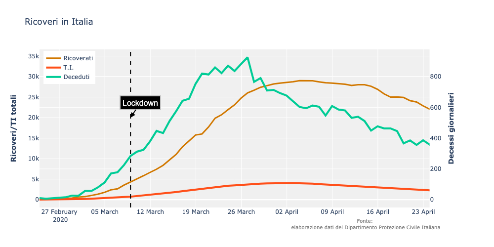

> More than 4000 people enter TI in a country which has in total few more than 5000, with outbreaking focused only in a specific zone.

**936 daily death for covid would be the tremendous peak reached that shows the power of Covid**. 
Interesting to observe the delay between the peak of daily death and the peak of max occupation in hospital: it's a bit strange to observe that the death peak precedes that of almost one week. 

This can be explained by the high saturation of the healthcare system, which invalidates an efficient approach to healing the patient and/or the difficulty in tracing and finding a covid case. 
About lockdown, it's very difficult to understand if was useful or not: the time in which the curve of diseased people decreases can be reasonable compared with the possible time of incubation and appearance of symptoms, but generally data doesn't show a piece of clear evidence.
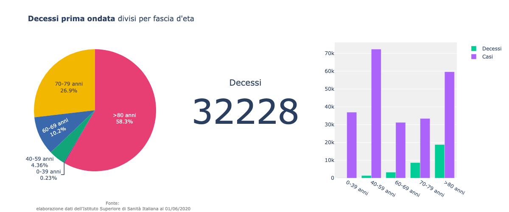

To do a brief recap, we can show how bad was covid 19 in terms of death, and understand the difference in age class:
- as we can see, Covid-19's death are almost people with an age greater than 70
- class 40-59, which is the one with most cases notified, has lower death, only 1406 on 32228. 

In addition, hospitalization data revealed that people with multiple COVID diseases have other health-conditional diseases, which can be correlated with a worse disease's progression.

The questions comes to people of all order it's the follow:

> **It's all these death caused by Covid?**

At the beginning of the pandemic we think that covid can be aggressive as the flu; incredibly in the end also people think that.
People's death is to covid or caused by covid?

**I try to answer the question with ISTAT data about the overall deceased in Italy in 2020.** 

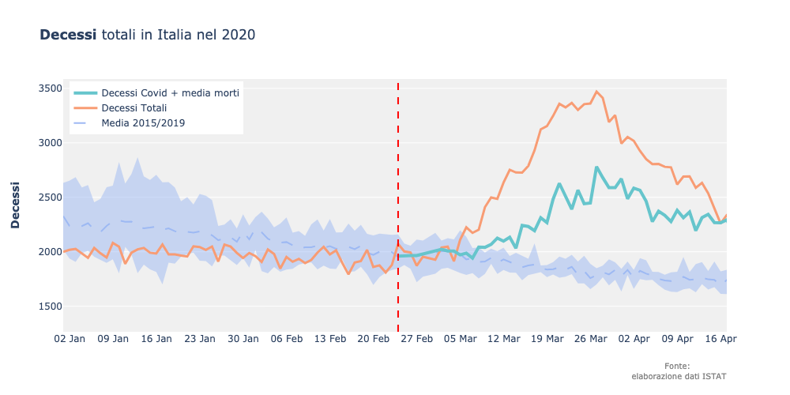

We can see the mean value of daily deaths in Italy, with max and min. 

And we also can see the excess death, the sum from the mean value of death plus the Covid one. 

And which this line only, we can compare it with flu what happens in a colder month, such as January, and see that covid is very similar to a very bad flu epidemy in terms of death. 

Instead, if we see the overall excess mortality, we can see a **higher curve, very high: it talks about a difference of almost 800 daily death from the excess covid death**. 

Now the question it's if this death is caused by Covid. 
And for what it's been said before, it can be reasonable. 

I show how covid it was *badly handled at the beginning*, and it's probably that a lot of possible cases weren't founded by the health system: and in a chaotic environment of the saturated hospitals, people died from covid. 
It's very difficult to find other causes or to think that these deaths can be caused indirectly by covid, as other diseases do not heal because covid: certain this can and probably happen, but not in the measure to justify all this difference.

When we see this data, it's important to consider that we live also a lockdown, which probably some good effects have on the pandemic, in particular, it was probably effective in limiting the outbreaking only in the north of Italy.

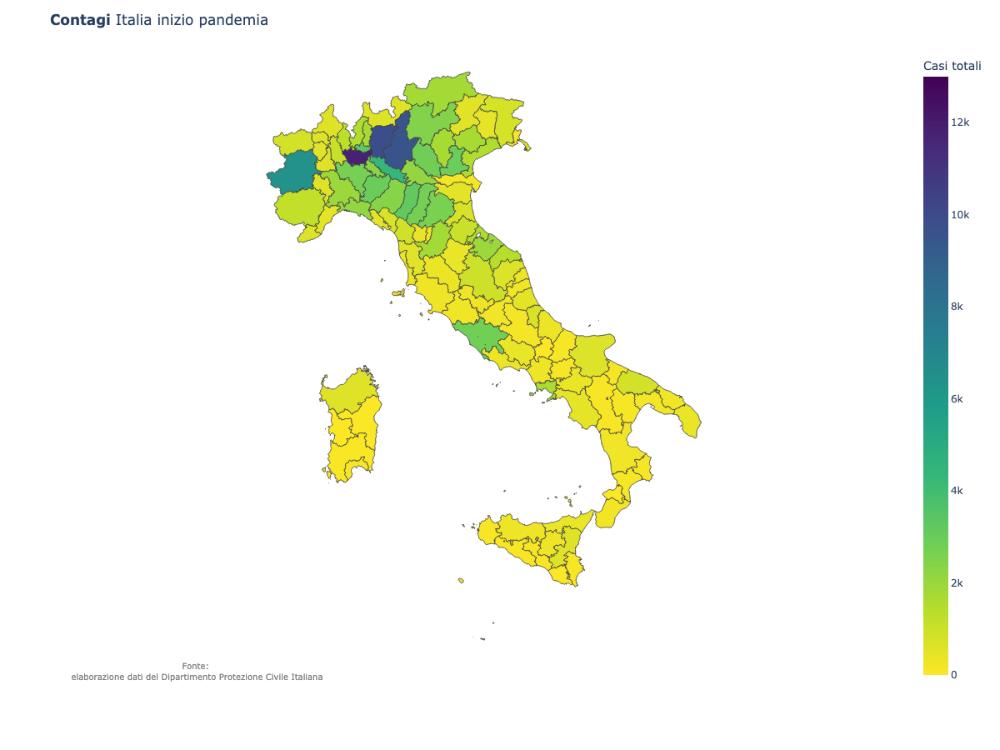

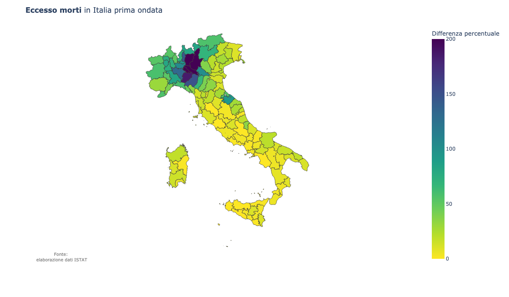

## Seconda e terza ondata

As all of us know, the summer of 2020 was a period of peace in which covid seems to be something passed: cases are low, and the will to move on was powerful. 

But nearly at the end of summer, cases start to rise again. Starting from September, a lighter increase of positive tests announce a new wave of coronavirus: a new variant, with highly spreading and quite the same effect, start to appear in all of Europe. 

In a world so shared, it's only a matter of time that a new version developed in other countries, like India, comes to us.

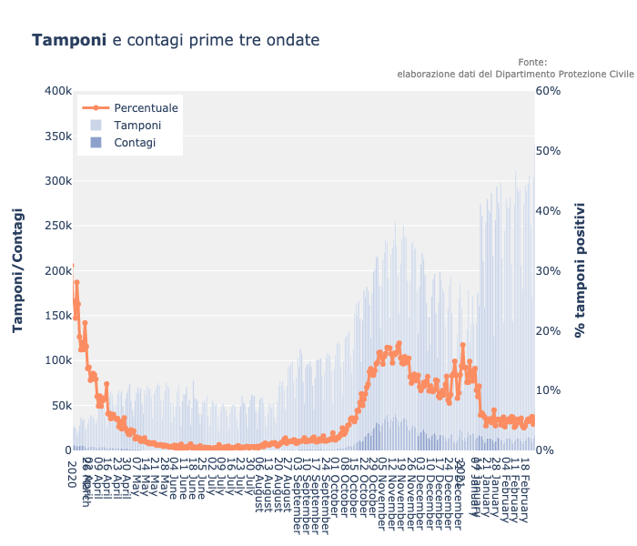

As seen, different from the first wave, **tracing works this time**: for several weeks, cases increased in a controlled way, and the percentage of positive test scants under the 5% threshold.

Also, the capacity in doing tests was hugely increased in the past months, *4 times better than the first wave*. And also this capacity became better and better with the course of the days. It's clear that this time Italy was better prepared, but also seeing other European countries can be reasonable to say that better would be possible to do. 

From mid-October start a new series of ordinance act to limit contagious: not a more a **rigorous lockdown**, but focus only on some activities that can be risks in an epidemy scenario. From this until early December, different measures get out quite every week, slowly the advancing virus, but not blocking. 

And this time, although also denying movement from region to region, epidemy spread on over the country.

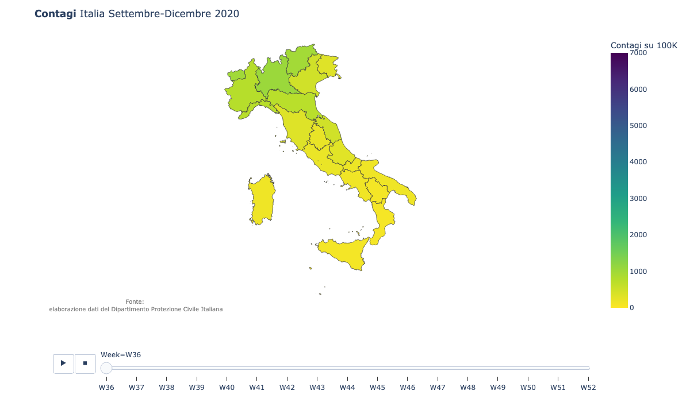

Lockdown denies us normal winter holidays. 

> This state of uncertainty lasted for several months: cases indeed didn't lower at zero, like the previous summer, but continues for other months. 

After a second wave, which ends approximately at the end of December, **cases start rising again in mid-February**: a new third wave, from February to the end of April. 

The wave was handled quite in the same way as before, with a similar result also. Appear difficult to understand a 100% efficient method to control epidemy: political action try more and more often to find a trade-off between the economy of heat. But there are to define some confrontations between these two waves and the first one. 

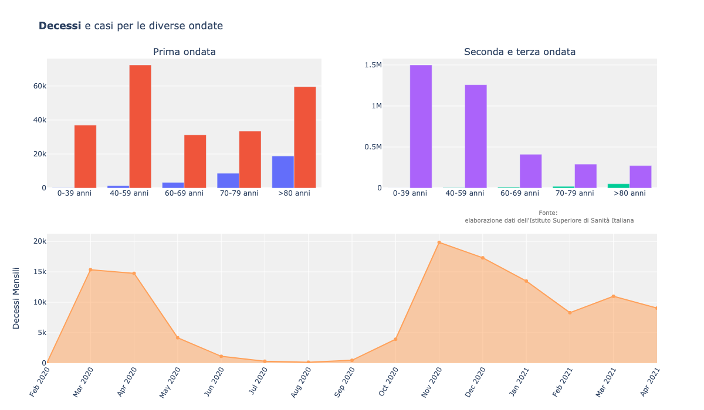

Deceased are similar in terms of composition: elderly people are the most cases of death.

Deaths are a bigger number in the last waves, but we have to say that this time the phenomenon was present all over the country. 

Also, a longer period than the first time has to be taken in mind. When the death composition remains the same, there is an evolution of cases composition: this can be caused by a true tracing of the virus when the first time it's probably be revealed only when symptoms appear.

Talking about death composition, and remind that probably excess mortality are a more accurate data rather than counted covid decease, we can observe the daily death in Italy for class age for the 2020 year

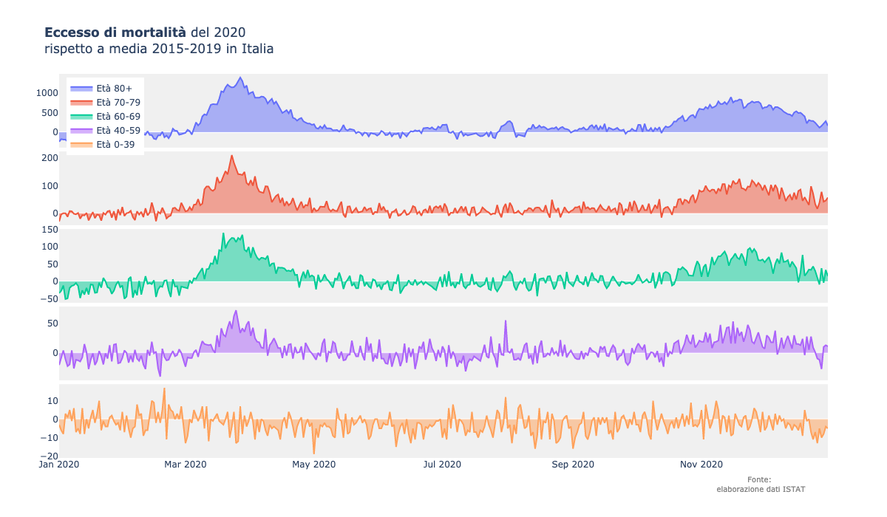

We can see the two waves of all ages, except the younger one. It also shows us that there isn't a defined peak in the second one: this means that the plague of the pandemic is lower, and so the spreading of it's probably more controlled than in the past. But analyzing this in terms of relative percentage, there are very few differences between the two waves.

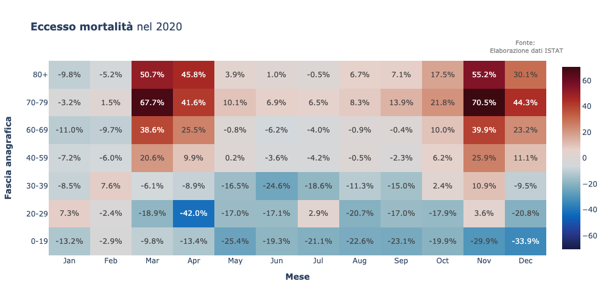

For the second wave's worst month, November, the percentage is higher than the first wave's worst month, March. 

This can also be seen in lower age classes. Difficult to understand what can cause that: a worst Covid variant? lower lockdown efficiency?

We first see that in the first wave the covid deaths are underestimated: now, **we can see how other waves behave**

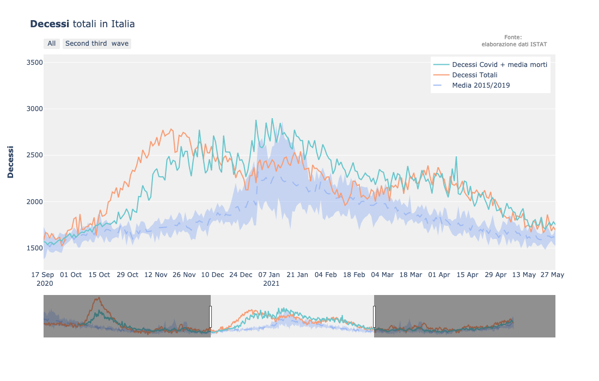

As we said, the difference is very lower between the first and second. 

We can see that there is some strange graph in December month: usually, December is characterized by the peak of flu disease; but this year, flu reaches a minimum in spreading. 

> This also can be justified by the huge restrain act, e.gs mandatory mask, that also touches flu spread.

For the third wave, we can see something very new: **covid deaths and excess mortality are quite the same.** 

This, added with also the lower rate in a wave of the positive test are the proof of a better-handled outbreaking of Covid.

## Vaccination campaign and fourth wave

In the third wave we've seen better handling of the virus, but in parallel was just happened is probably the main turning point of this story: **the first vaccines available**.

Pfizer and Modern start to be used at the end of 2020. The first vaccinated will be healthcare staff and older people. The vaccine campaign starts from here. Unfortunately, the doses of the vaccine are very low: the request for it is not satisfied by the production. And so, only in few are the people vaccinated in the first months.

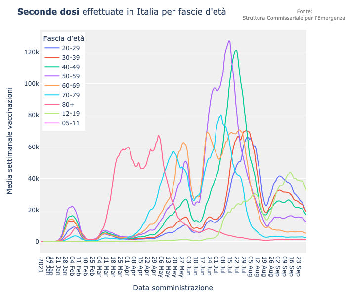

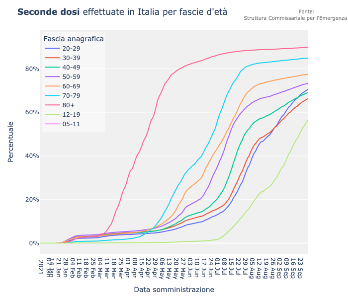

I choose second dose injections because are the ones which gave effective protection against covid. 
We see a first period, that corresponds to the first phase of the campaign; and we have to wait for mid-march to have an important increase of people fully vaccinated. 

And also we have to consider that vaccination is divided by class age, and frail people, such as the 70-79 segment, had to wait until mid-may. 

So, at top of the third wave, we have two classes of age with high mortality and differences in vaccination rate: there is a visibility of this state?
Analyzing the 2021 Istat mortality, actually, it's possible to observe that there are differences in mortality rate between the 80+ an 70-79

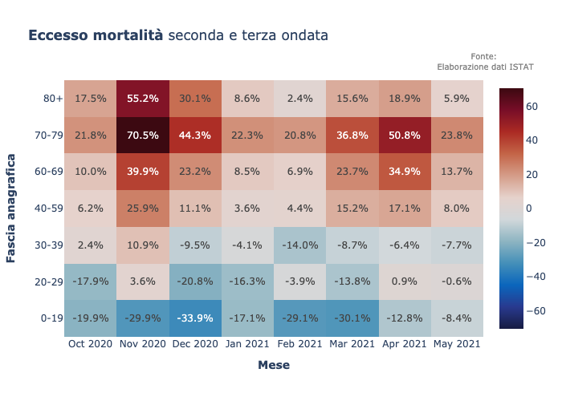

The third wave for the oldest people seems to be less dangerous rather than other classes, like 70-79 and also 60-69. 

It's not 100% proof: correlation is not enough. For example, in April only 30% of 80+ people are protected from Covid. 

But from a scientific view, it's a possible confirmation about the efficiency of vaccine, counterchecks also with other countries (e.g. Israel)
To understand the efficiency of vaccination we observe the differences in the two populations, the non vaccinated and the one with a full cycle

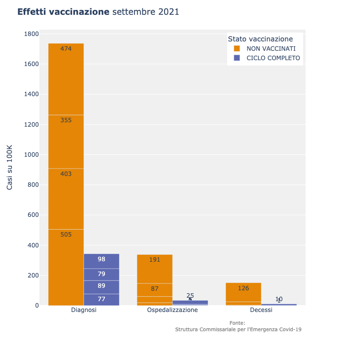

As we can observe, several diseases are highly avoided with full vaccination. 

The vaccine seems to have efficiency also in the spreading of the virus, with lower cases. This efficiency was finally been shown during the 4th wave, which occurs in the last month of 2021. A new variant, omicron, runs into all of Europe, and showed high contagiousness but lowers several cases.

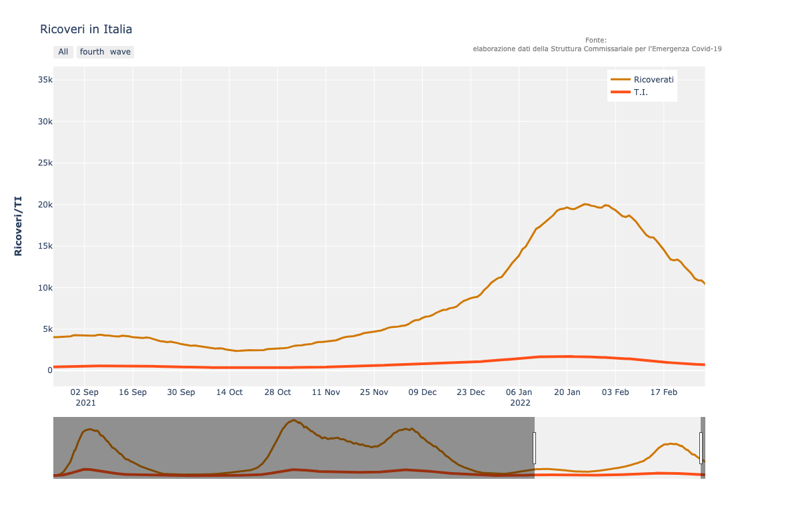

We can observe that this time hospitalization is lower than ever, and TI reach a medium saturation level. Vaccinated people present a lower possibility to enter TI and die from covid. This brings to a non-critic situation that, with lower restriction measures. Omicron other hand was for sure to be remembered for its high contagiously: indeed, several tests result positive, with our country running the risk to have a fake lockdown, caused by all the people infected without symptoms that need quarantine.

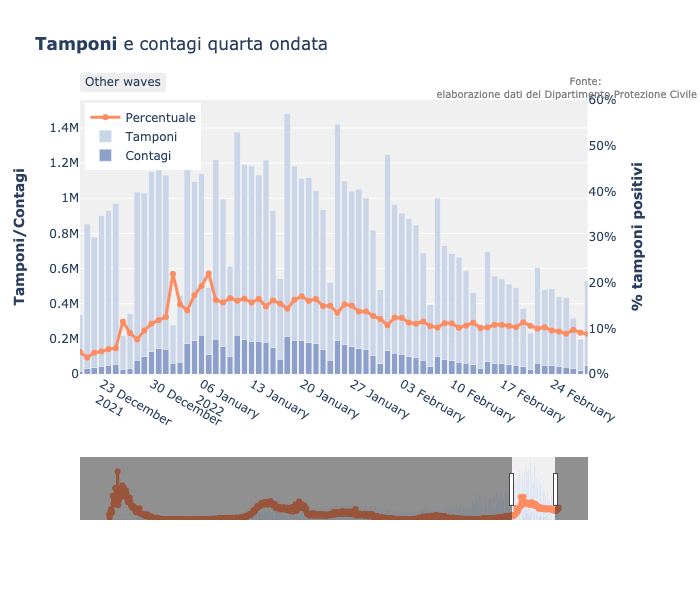

> This increase in cases can only be explained with the different variant?

One of the main changes during the fourth wave is the use of antigenic tests: these are a lower reliability, but are simpler to do. In this phase, with higher contagious, we can also observe an increase in the use of these tests. We can also see the differences between the probability to be positve on the two different tests: this is present before also the beginning of the fourth ewave and tends to inrease in corresponce of the peak. It's difficoult to find a reason for this difference: can be caused for example by the difference case in which tests are use; to confirm the presence of Covid (higher probability to be positive), or used as routine test (lower in this case) 

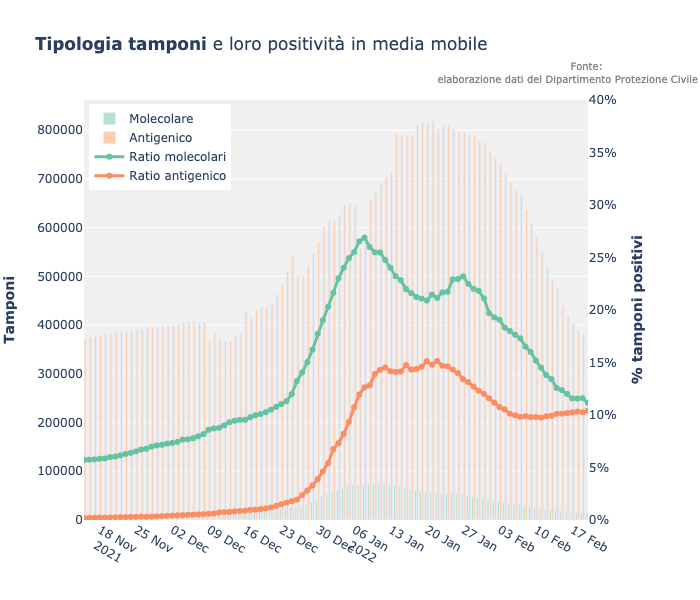

The positive tests are not equal to new positive people: indeed can be few tests done for each case. It's possible that in the fourth wave, a time near to winter holiday, can be the waves over estimated by too much test done? In this case, we observe two variable: the **positive test** of the two kind and the **mean number of tests for each case tested**. 

I have to say that this last variable has problematic in terms of policy (values are corrected measured? which tests are evalueted in this?), but can still give us a picture of the trend. We can also observe the increase of this value due to the mandatory test to work in october, that caused the necessity for unvaccineted people to be testefrequently. On winters holyday this increasing is not visible and on the contrary is quite the opposite, caused probably by the saturation of pharmacy and holidays. In any case, the new positive cases, for each typology of test, doesn't seems **to be strongly linked with an increase of test for person**

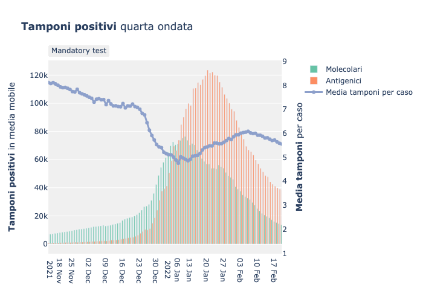

This added with the fact the duration of protection of vaccine was lower than expected, encouraging the scientific community and the government of all world to do another dose of vaccine, the so-called **booster dose**.

First only suggest for an older people, from November third dose was suggested for everyone. For this purpose, I show the vaccination campaign occurring in Italy

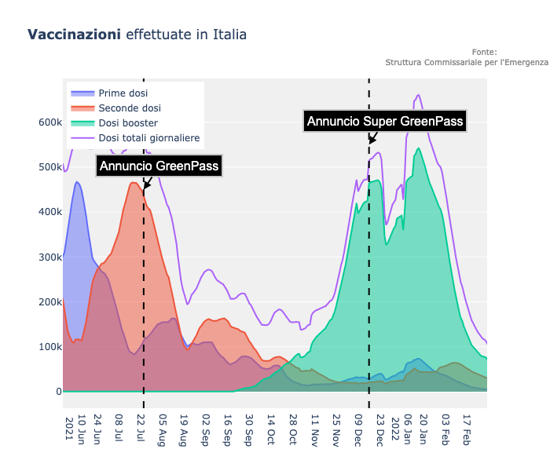

I like also to talk about the greenpass, a vaccination certification mostly that would be necessary to access from restaurants at the beginning, and more and more service with the succession of months. Know that is very difficult to understand if GreenPass has a good efficiency in the spreading of covid. it's possible to analyze if it was useful to obtain more vaccination around the population. As we can see, the first greenpass announced at mid of July was useful to increase a lower curve of daily vaccination; the same can be shown for the "super" greenpass, which rends quite mandatory for the third shot for everyone. Campaign vaccination became very important to the government, and the result obtain are quite good. 

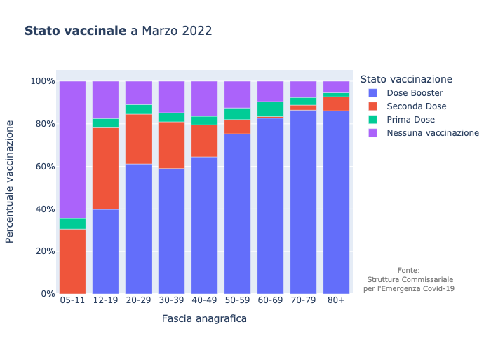

This political decision still didn't touch fewer percentage of the population, but the call of people for also the booster dose was very good. Unfortunately, for the older class age, non vaccination results in a greater percentage of several covid cases. According to the TI data, the efficacy of vaccination is visible in the population older than 40 years; also is notable the difference between the third dose and second dose. For lower age persons, vaccination is still efficacy, but the advantages of the third dose it's not so clear.

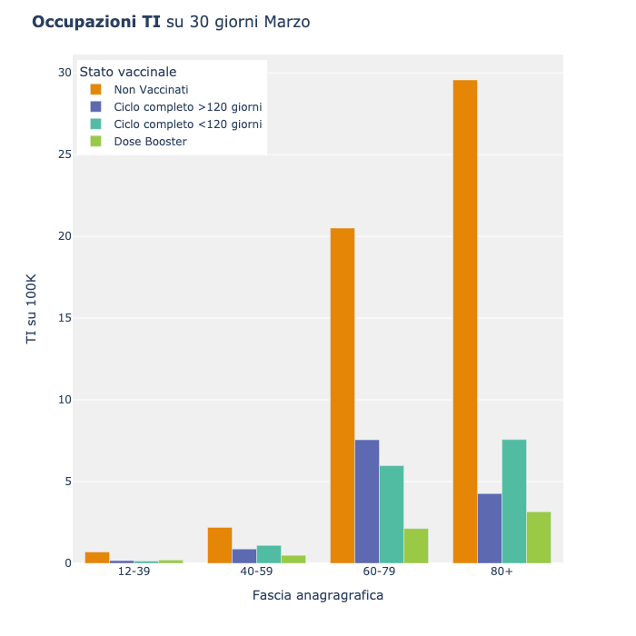
